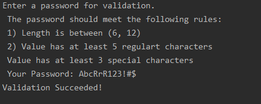

## Password Validator

In this project, you are going to implement a program that validates a password entered by a user.

## Task & Flow
The program starts by asking the user to enter a password that suits the following criteria:
- Length should be between 9 and 12 characters
- Password has at least 3 special characters
- Password has at least 5 normal characters (letters)

You may then use a loop to check password characters one at a time. 
Our special characters that are supported by this project are: **&, #, $, !, ?, ", (, )**

##Guidelines & Hints
- The program is expected to exit when at the first condition that is not met. A statement to guide the user what condition is not met should be printed.
- You may use counters at the loop to count different types of characters you need.
- A success statement by the end should be shown if all conditions are met.
- Try to define your fixed values at the beginning of the script so you later use/modify them easily without changing every occurrence within the script.

## Examples
Here are two example for a run. The first one is failure case while the second is a successful one.
## Failure Validation Case

## Successful Validation Case

## Bonus Task
Add the condition where the password needs to have at least 3 numbers.