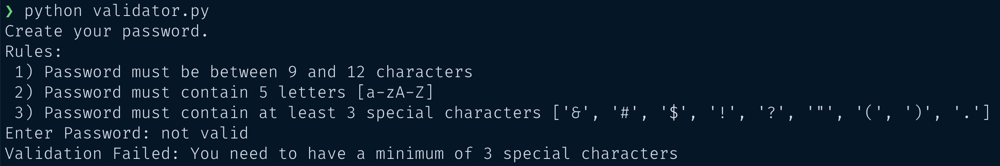
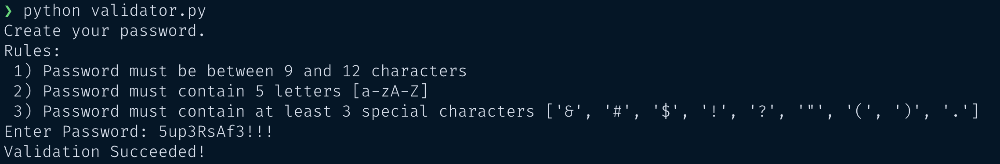

## Password Validator

In this project, you are going to implement a program that validates a password 
entered by a user.

## Steps

The program should start by asking the user to enter a password with these criteria:

- Length must be between 9 and 12 characters
- At least 3 special characters
- At least 5 alphabetic characters
- At least 3 numeric characters

You may then use a loop to check password characters one at a time. 

The special characters for this project are: **&, #, $, !, ?, ", (, )**

Your validation messages should be:

* Successful validation
  > Validation Succeeded!
* Unsuccessful validation
  > Validation Failed: Password length should be between 9 and 12
  
  > Validation Failed: You need to have a minimum of 3 special characters
  
  > Validation Failed: You need to have a minimum of 5 alpha characters
  
  > Validation Failed: You need to have a minimum of 3 digits

## Hints

- It may be helpful to initialize counter variables outside the loop to count 
  different types of characters you need.
- A success message should display if all conditions are met.
- The program should exit when it encounters the first failed condition. Print a 
  message explaining the condition that was not met.
- Define your constants at the beginning of the program, so you can use them 
  later on without changing every occurrence within the script.

## Sample Runs

Failed Validation:

Successful Validation:

## Starter Code

Check the file called `validator.py`, and start writing your code there.

